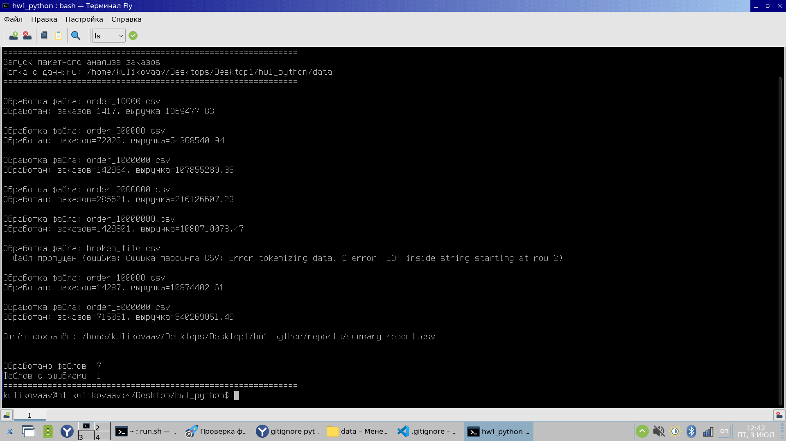
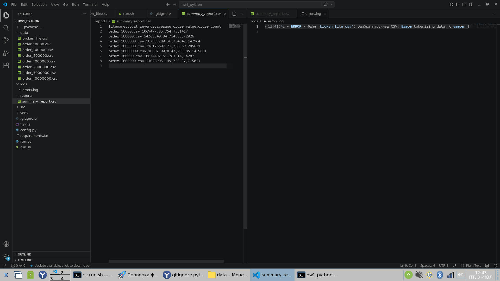

# Основы Python

## Задание

Разработайте скрипт для пакетного анализа данных о заказах интернет-магазина. Данные находятся в нескольких CSV-файлах в папке data/. Скрипт должен обработать все файлы в папке, рассчитать метрики по каждому файлу и сохранить общий результат.

## Данные

Для работы были использованы данные скачанные [kaggle.com](https://www.kaggle.com/datasets/swainproject/synthetic-order-records-10k-to-10m-records)

Также был подложен [испорченный датасет](./data/broken_file.csv)

## Запуск

```bash
./run.sh
```

**Важно!** Для работы программы необходим python3

## Результат





Созданный [отчет](./reports/summary_report.csv)

```
filename,total_revenue,average_order_value,order_count
order_10000.csv,1069477.83,754.75,1417
order_500000.csv,54368540.94,754.85,72026
order_1000000.csv,107855280.36,754.42,142964
order_2000000.csv,216126607.23,756.69,285621
order_10000000.csv,1080710078.47,755.85,1429801
order_100000.csv,10874402.61,761.14,14287
order_5000000.csv,540269051.49,755.57,715051
```

В [журнале событий](./logs/errors.log) виднеется следующая запись

```
2026-07-03 12:41:42 - ERROR - Файл 'broken_file.csv': Ошибка парсинга CSV: Error tokenizing data. C error: EOF inside string starting at row 2
```
